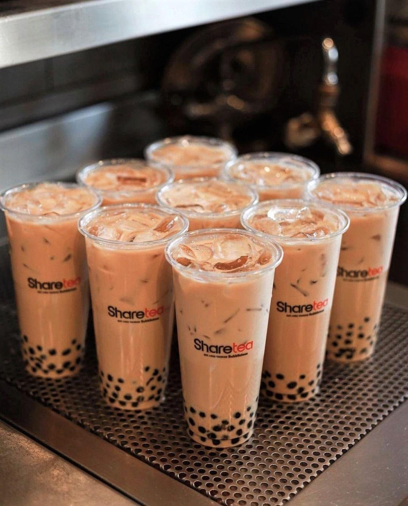

<style>
h1.title {
  color: #A085C6;  /* taro color */
}
</style>

<style>
.author {
  color: #E75480;  /* raspberry red */
}
</style>

<style>
h1 {
  color: #A085C6;  /* taro color */
}
</style>

<style>
h2 {
  color: #E75480;  /* raspberry red */
}

</style>

<style>
h3 {
  color: #A7D3A6;  /* Mint Green */
}

</style>



# Boba Breakdown
## Evolution of Boba
The boba tea industry is an increasingly popular business, projected to grow from 2.83 billion to 4.78 billion by 7.81% (by 2032) and is becoming more prominent within young people (Fortune Business Insights). Boba provides personalized beverages with various tapioca pearls, making the drink more mainstream as it originated in Taiwan in the 1980s. 

## Our Constructed Dataset
This dataset consists of different boba shops and their most popular flavors that they sell. We create an adjacency matrix based on if the shop has it listed as their most popular flavor. The edges represent whether the boba shop considers the flavor as its most popular and the nodes are the shops and flavors. Makayla collected the data by going to the boba shop websites and gathering the most popular flavors, then inserting the data into Excel (1 representing a relationship, 0 representing no relationship). This data was collected on June 2, 2025. 

## Main Objective and Question
**Our research question is which boba flavor/ingredient is the most popular/profitable? Our objective was to find out the most popular and most profitable flavor within select boba shops. This gives boba shops who don’t spotlight those flavors some insight so that they can incorporate it into their menu more.** 

# Setup Code

Data was collected from various websites of boba shops establishing a relationship between the popular flavor and the shop
[(download the dataset)](Boba_Data.csv). 

Here are the boba tea shops we used. 

[ShareTea](https://www.1992sharetea.com), [Pochi](https://pochibubbletea.com/), [Happy Lemon](https://happylemonusa.com), [DIY Tea Lab](https://www.diytealab.com/), [Tealogy](https://www.tealogyusa.com), [Ding Tea](https://www.dingtea.com/en/index/index.html), [Boba Gem](https://www.bobagemteahouse.com), [BÖBA](https://boba-bothell.com), [CHICHA San Chen](https://chichasanchenny.com)

```{r setup, include=TRUE, eval=TRUE, warning=FALSE, message=FALSE}
#insert packages
library(igraph)

#read in boba_data csv and create it into a matrix
trial <- read.table("Boba_Data.csv", sep = ",", header = TRUE)

trial <- as.matrix(trial)

#create bi adjacency matrix 
boba <- graph_from_biadjacency_matrix(trial)

# node id and mode membership 
id <- c(1,2,3,4,5,6,7,8,9,10,11,12,13,14,15,16,17,18,19,20,21,22,23,24,25,26,27,28)
mode <- c(1,1,1,1,1,1,1,1,1,1,1,1,1,1,1,1,1,1,1,2,2,2,2,2,2,2,2,2) 
nodes <- data.frame(id,mode)

```

# The Flavor's Centrality

## Visualization Choices 
When creating the network, we wanted to highlight the degree in node size in order to really get the idea of the flavor that has the most power or is the most popular. For the colors, we chose something that was brighter but also subtle and for the edge color we chose a grey (not too dark not too light). For the labels we used label.cex, label.dist, and label.degree in order to get some of the labels out of the way and improve readability because the default was too cluttered. For the label color, we chose black and used the attribute to control the font to get a more bold look from the text.The layout was layout_with_graphopt because we wanted the nodes to be spread out and not layered on top of each other and a lot of the other options gathered the nodes very close.

```{r labels, include=FALSE, echo=FALSE}
#allows for the labels 
rownames(trial) <- c("TPMT", "MTBL","MTO", "MTG", "Mango", "Straw", "Passion", "BrownSugar", "Matcha", "Taro", "TOreo", "Oreo", "Avocado", "Cook&Cream", "Ube", "Grapefruit", "Osman", "Winter", "Lychee")
colnames(trial) <- c("ST", "PCH", "HL", "DIY", "TLGY", "DT", "BG", "BOBA", "CSC")
original <- V(boba)$name
V(boba)$name <- c(rownames(trial), colnames(trial))
```

## Network: Which Flavor Holds the Most Power? 

```{r boba, include=TRUE, echo=TRUE}
#changes the node size by degree, label sizes, label distance, and label degree 
V(boba)$size <- degree(boba) * 2
V(boba)[1:10]$label.cex <- 0.5
V(boba)[11:19]$label.cex <- 0.6
V(boba)[20:28]$label.cex <- 0.62
V(boba)[1:10]$label.dist <- 0
V(boba)[11:19]$label.dist <- 1
V(boba)[19:28]$label.dist <- 0
V(boba)$vertex.label.degree <- pi 

set.seed(5)
boba_plot <- plot(boba, 
     vertex.color=ifelse(nodes[V(boba), 2] == 1, "#FFD3B5", "#F9AFAE"),
     vertex.label = V(boba)$name,
     vertex.label.color = "Black",
     vertex.label.family = "Arial Bold",
     frame.color = NA,
     edge.color = "#7E7E7E",
     layout = norm_coords(layout_with_graphopt(boba), xmin = -1, xmax = 1, ymin = -1, ymax = 1),
     main = "Which Flavor Holds the Most Power?",
     sub = "Nodes weighted by degree metric"
     
    
     
    
    )
colors <- c("#FFD3B5", "#F9AFAE")
legend("topright", c("Flavors", "Boba Tea Shops"),pch=21,
       col="#777777", pt.bg=colors, pt.cex=1.5, cex=.8, bty="n", ncol=1,
       ) 


```

**Original vs. Abbreviated names** 
```{r table, include=TRUE, echo=FALSE}
name_table <- data.frame(
  Original = original,
  Abbreviated = V(boba)$name
)

name_table

```

## Network Meaning
Our network is a two mode network that represents the relationship between boba tea shops and flavors. Using the degree as a metric of centrality, we displayed the flavors that are the most popular and common at all the shops. This showed that Milk Tea Black Tea, Brown Sugar, Mango, and Strawberry are the most popular/common between the Boba Tea Shops. With Cookies and Cream, Taro Oreo, Grapefruit, and Osmanthus as the least popular/common between the Boba Tea Shops. 

# Analysis 
## Two-Mode Network Analysis
```{r pressure, echo=FALSE}

shops <- trial%*%t(trial)

# shop-by-shop matrix
shopnet <- graph_from_adjacency_matrix(shops, mode="undirected", 
                                          diag = FALSE, weighted = TRUE) # graph object of shop-by-shop network

# flavor-by-flavor matrix showing the number of shops co-supporting each pair of flavors
flavors <- t(trial)%*%(trial) # pre-multiply the transpose by the original matrix to get a flavor preference-by-flavor preference matrix with weighted ties showing the number of shops they share in common

flavornet <- graph_from_adjacency_matrix(flavors, mode = "undirected",
                                         diag = FALSE, weighted = TRUE) # graph object of flavor-by-flavor network
id <- c(1,2,3,4,5,6,7,8,9,10,11,12,13,14,15,16,17,18,19,20,21,22,23,24) # create node ids

# a graph object of the original two-mode data set
trialnet <- graph_from_biadjacency_matrix(trial) # graph object from original two-mode matrix

# visualize all three graph objects and include edge weights when appropriate (use a 1x3 plot space)

id <- c(1,2,3,4,5,6,7,8,9,10,11,12,13,14,15,16,17,18,19,20,21,22,23,24) # create node ids
mode <- c(1,1,1,1,1,1,1,1,1,2,2,2,2,2,2,2,2,2,2,2,2,2,2,2) # create mode membership
trial_nodes <- data.frame(id, mode) # create node data frame to differentiate modes

par(mfrow=c(1,3), mar=c(4,2,4,2), mgp=c(2,0.5,0))

plot(trialnet, vertex.label.cex=.6, vertex.label.color="black", vertex.size=8, 
     vertex.color=ifelse(trial_nodes[V(trialnet), 2] == 1, "lightgray", "lightblue"),
     vertex.frame.color="NA", vertex.label.dist=2)

plot(flavornet, vertex.label.cex=.6, vertex.label.color="black", vertex.size=8, 
     vertex.color=ifelse(trial_nodes[V(trialnet), 2] == 1, "lightgray", "lightblue"),
     vertex.frame.color="NA", vertex.label.dist=2)

plot(shopnet, vertex.label.cex=.6, vertex.label.color="black", vertex.size=8, 
               vertex.color=ifelse(trial_nodes[V(trialnet), 2] == 1, "lightgray", "lightblue"),
               vertex.frame.color="NA", vertex.label.dist=2)

# What is/are the most central policy preferences in the  network? (it is up to you to define and operationalize "central")
degree(flavornet)  

# Which organization would you identify as a potential broker of disparate policy preferences to build a coalition?
betweenness(shopnet, directed = FALSE)

```

## Popular Bubble tea flavors by Sum
```{r pressure2, echo=FALSE}
# Only keep the flavor nodes (first rows of the adjacency matrix)
flavor_names <- rownames(trial)
shop_names <- colnames(trial)

# Calculate degree (number of shops listing that flavor as popular)
flavor_popularity <- rowSums(trial)

# Create a data frame for ggplot
flavor_df <- data.frame(
  Flavor = factor(flavor_names, levels = flavor_names[order(flavor_popularity)]),  # for ordered bar chart
  Popularity = flavor_popularity
)

# Plot using ggplot2
library(ggplot2)

ggplot(flavor_df, aes(x = Flavor, y = Popularity)) +
  geom_bar(stat = "identity", fill = "#F9AFAE") +
  coord_flip() +
  theme_minimal() +
  labs(
    title = "Popularity of Boba Flavors",
    x = "Flavor",
    y = "Number of Shops Featuring Flavor"
  ) +
  theme(
    plot.title = element_text(hjust = 0.5, size = 14, face = "bold"),
    axis.text.y = element_text(size = 10)
  )

```

# Conclusion

As this network targets audiences for bubble tea businesses and those who have a personal interest in bubble tea by enjoying the drink. Based on our centrality analysis, the biggest significance of this network is that readers understand which flavor is the most central and popular amongst bubble tea shops from Everett to Seattle. If a flavor occurs often between bubble tea shops, that means they are good sellers, profitable, and thus a wise choice to incorporate into a menu for new aspiring bubble tea shops. Additional work that could be done on the bubble tea could be changing the variable of flavors to toppings. 

## Limitations

A few limitations occurred during this analysis regarding the data collection process. One issue being that some bubble tea places do not keep their websites up to date, and another limitation being that it is common for the websites to not showcase all the flavors that were available in the shop menu.


